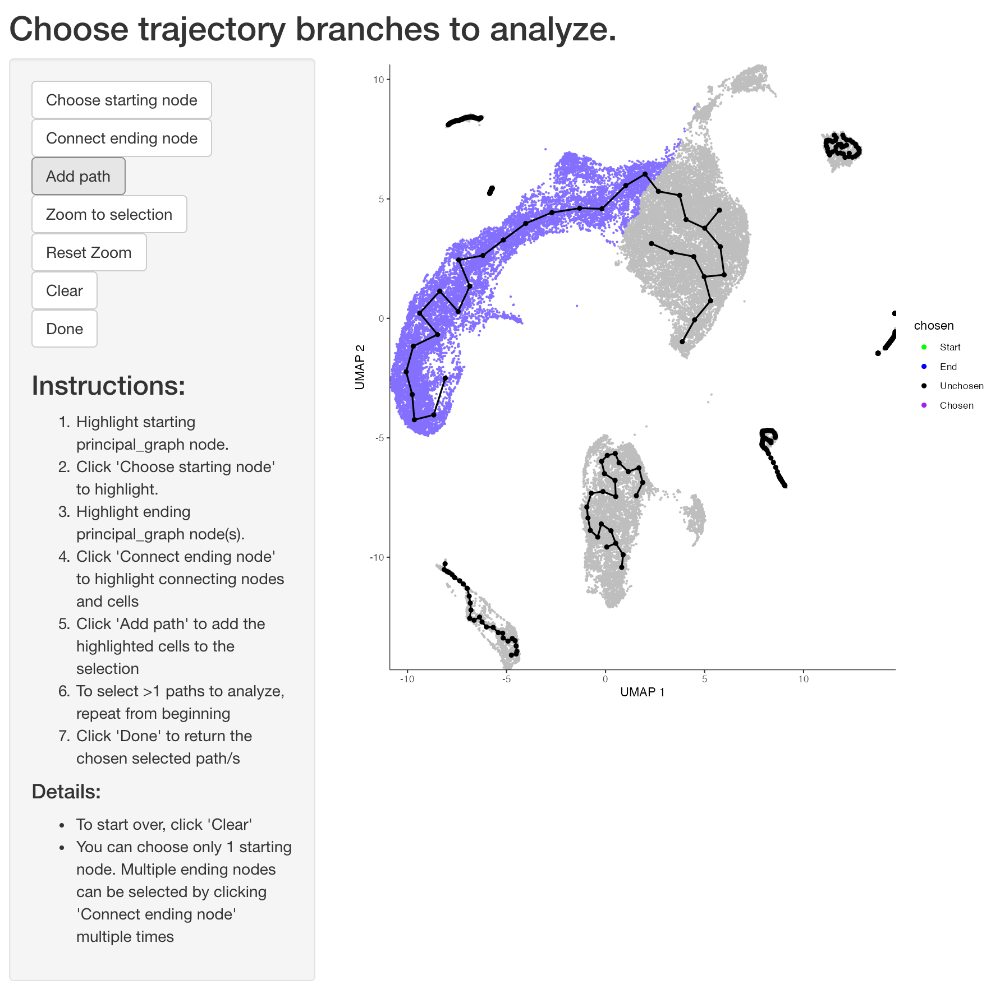
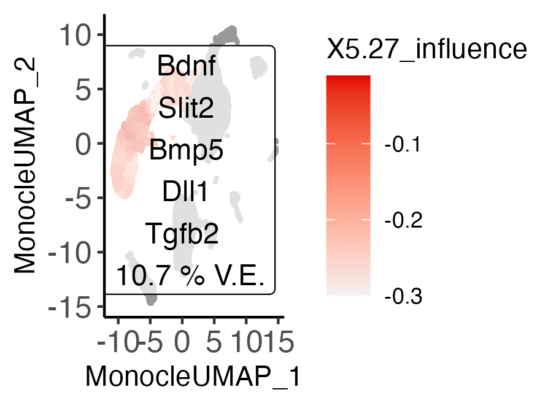

# Ligand-Trajectory Analysis from a Seurat object.
This document outlines a basic Entrain analysis starting from a Seurat object. By the end of this document, you will identify ligands that are driving the trajectories in your data.
### Prior assumptions:
1. You have an idea of which cell clusters comprise the 'niche', or ligand-expressing cells, in your dataset.
2. Your dataset has sufficiently sampled cells from all beginning, intermediate and terminal stages in the differentiation continuum.
#
```{r Libraries,message=FALSE, results='hide', class.source = 'fold-show', eval=FALSE}
library("SeuratDisk"); library("Seurat"); library("SeuratWrappers"); library("dplyr");
library("entrain")
```
```{r Libraries show,message=FALSE, results='hide', class.source = 'fold-show'}
library("SeuratDisk"); library("Seurat"); library("SeuratWrappers"); library("dplyr");
devtools::load_all()
```
# Pre-processing and loading required data.
## Loading in required data
We will download a developing mouse brain atlas dataset at gestation day 10/11. The following code block downloads the .gz file, decompresses it, and converts it into a Seurat object for analysis.
```{r Read dataset, warning=FALSE, message=FALSE, results='hide', class.source = 'fold-show'}
options(timeout=3600)
#download.file("https://zenodo.org/record/7233173/files/Manno_E10_E11.rds", "../data/Manno_E10_E11.rds")
obj <- readRDS("../data/Manno_E10_E11.rds")
```

Entrain relies on the NicheNet database of ligand-receptor-gene networks for the prior knowledge needed to make conclusions about environmentally-influenced trajectories.
The genes here have been pre-converted from the original human genes to mouse orthologs.
```{r Read NicheNet show, results='hide', class.source = 'fold-show', eval=FALSE}
lr_network_mm <- readRDS(url("https://zenodo.org/record/7233173/files/lr_network_mm.rds")) #
ligand_target_matrix_mm <- readRDS(url("https://zenodo.org/record/7233173/files/ligand_target_matrix_mm.rds"))
```
```{r Read NicheNet, echo=FALSE, results='hide', class.source = 'fold-show'}
lr_network_mm <- readRDS("../data/lr_network_mm.rds")
ligand_target_matrix_mm <- readRDS("../data/ligand_target_matrix_mm.rds")
```

## Data at a glance
The data consists of cells in the developing mouse brain at day 10 after gestation. This comprises a population of neuroblasts rapidly differentiating to neurons (our cells we are going to analyse), as well as their complex microenvironment made up of cells from the endoderm, mesoderm, fibroblastic, blood, and immune compartments.
```{r Dataset at a glance, class.source = 'fold-show'}
n_clusters <- obj@meta.data$Class %>% unique() %>% length()
cols = Seurat::DiscretePalette(n = n_clusters, palette = "alphabet2")
DimPlot(obj, group.by = "Class", cols=cols)
```

# Run Entrain 
## Entrain from a fresh Seurat object.
Entrain fully integrates the Monocle3 package to learn trajectories. All steps of Monocle, as well as Entrain analysis, are encapsulated in an interactive workflow with the function `get_traj_ligands_monocle()`.

``` {r, results='hide', eval=FALSE, class.source = 'fold-show'}
obj_entr<-get_traj_ligands_monocle(obj,
                                   sender_cluster_key = "Class",
                                   lr_network = lr_network_mm, ligand_target_matrix=ligand_target_matrix_mm)
```

This function launches three main interactive steps that require input from you:
1. Call Monocle3 to learn trajectory paths. This will require you to select a 'root' cell node. In most cases, you should choose cells that correspond to the precursor/progenitor cells in your system.
2. Second, select the cell clusters corresponding to the microenvironment.
3. Third, select the trajectory branches that you wish to analyze.
``` {r, echo=FALSE}

```

## Run Entrain on a Monocle trajectory that you have previously generated.
  If you already have a pre-generated trajectory generated with the `monocle3` package, Entrain allows you to start from that dataset instead of re-running the process. The pre-generated trajectory should have `monocle3::learn_graph()` and `monocle3::order_cells()` called on it already, and should be passed into the argument `get_traj_ligands_monocle(..., cds = monocle_cds)`
``` {r, eval=FALSE}
obj_entr<-get_traj_ligands_monocle(obj, cds = monocle_cds,
                                   sender_cluster_key = "Class",
                                   lr_network = lr_network_mm, ligand_target_matrix=ligand_target_matrix_mm)
```


## Run Entrain in a script.
This is most useful when you are running on a compute cluster without a GUI. Here, we have to first plot the Monocle results in order to identify which trajectory branches we'd like to analyze.

``` {r, message=FALSE, warning=FALSE, eval=FALSE}
monocle_cds <- as.cell_data_set(obj)
monocle_cds <- monocle3::preprocess_cds(cds = monocle_cds, num_dim = 10)
monocle_cds <- monocle3::reduce_dimension(cds = monocle_cds)
monocle_cds <- monocle3::cluster_cells(cds = monocle_cds, reduction_method = "UMAP")
monocle_cds <- monocle3::learn_graph(monocle_cds,
                                     use_partition = TRUE,
                                     close_loop = FALSE,
                                     learn_graph_control = list(
                                         minimal_branch_len = 5,
                                         ncenter = 50))
#
node_coords <- monocle_cds@principal_graph_aux$UMAP$dp_mst %>% t() %>% as.data.frame() %>%
    mutate(node = rownames(.)) %>% stats::setNames(c("x", "y", "node"))
monocle3::plot_cells(monocle_cds, color_cells_by="Class") +
    geom_point(data = node_coords, aes(x=x, y=y)) +
    geom_text(data = node_coords, aes(x=x, y=y, label=node))
```
``` {r, echo=FALSE}
obj_entr<-readRDS("../data/manno_entrain_monocle.rds")
monocle_cds <- obj_entr@misc$entrain$monocle_cds
node_coords <- monocle_cds@principal_graph_aux$UMAP$dp_mst %>% t() %>% as.data.frame() %>%
    mutate(node = rownames(.)) %>% stats::setNames(c("x", "y", "node"))
monocle3::plot_cells(monocle_cds, color_cells_by="Class") +
    ggplot2::geom_point(data = node_coords, ggplot2::aes(x=x, y=y)) +
    ggplot2::geom_text(data = node_coords, ggplot2::aes(x=x, y=y, label=node))
```
We can see that Monocle has captured some spurious trajectories as well as some potentially biological ones. Entrain allows us to analyze only the trajectories that we are confident in; in this example we can be more confident in the neuroblast differentiation trajectory bounded by nodes `Y_5` and `Y_27`.
We will also label the radial glial cells at node `Y_7` as the root cells, by setting `root_pr_nodes = "Y_7"`

``` {r, message=FALSE, warning=FALSE, eval=FALSE}
obj_entr <- get_traj_ligands_monocle(obj, cds = monocle_cds,
                                   sender_cluster_names = c("Blood", "Endoderm", "Fibroblast",
                                                              "Immune", "Mesoderm"),
                                   sender_cluster_key = "Class",
                                   root_pr_nodes = "Y_7",
                                   path_nodes = c("Y_5", "Y_27"),
                                   lr_network=lr_network_mm, ligand_target_matrix=ligand_target_matrix_mm)
```


# Visualizing results

## At a glance
We can visualize the top ranked ligands at a glance with the following function, replacing "celltype" with the relevant column name in obj@meta.data

``` {r, class.source = 'fold-show'}
plot_ligand_trajectories(obj_entr, color_cells_by = "pseudotime", group_label_size=3)
```


This suggests a number of ligands responsible for B cell and osteoblast maturation processes. These are well-established in literature as key drivers for cell differentiation. These ligands are relatively low in expression, and so would be difficult to pick up with a standard ligand-receptor analysis compared to more strongly expressed, but less biologically impactful ligands. NicheNet is unable to detect these ligands using default parameters. With a bit of threshold tuning, NicheNet fares better but still fails to include these ligands in the top 5.

##In detail
We can visualize the invididual ligand-gene relationships that contributing most to the trajectory dynamics. This data is extracted from the underlying NicheNet database that Entrain uses for fitting.

``` {r, results='hide', class.source = 'fold-show'}
paths <- obj_entr@misc$entrain$paths %>% names()
plot_lig<-plot_ligand_targets(obj_entr, path=paths[1], ligand_target_matrix = ligand_target_matrix_mm)
```

We can visualize the top covarying genes of a trajectory, including genes that are not influenced by extracellular signaling.

``` {r, class.source = 'fold-show', fig.width=5, fig.height=8}
plot_genes<-plot_covarying_genes_scatter(obj_entr, path=paths[1], color_key="Class", n_top_genes = 10)
plot_genes
```

## Cell-wise influences
Trajectory branches represent a continuum of states, which may comprise varying degrees of environmental dependence along the continuum. We can visualize where the environmental influence is occurring in this continuum to generate hypotheses about cell states which more or less prone to environmental influence.

``` {r Influences, warning=FALSE, class.source = 'fold-show', eval=FALSE}
obj_entr<-cellwise_influences(obj_entr,
                              ligand_target_matrix=ligand_target_matrix_mm,
                              step_size=0.10,
                              window_pct=0.30,
                              n_top_ligands=5)
plot_ligand_influences(obj_entr)
```
``` {r, echo=FALSE}

```

Our influence analysis suggests that region most strongly influenced by the environment is around the border of neuroblast and neuron cell type label.

